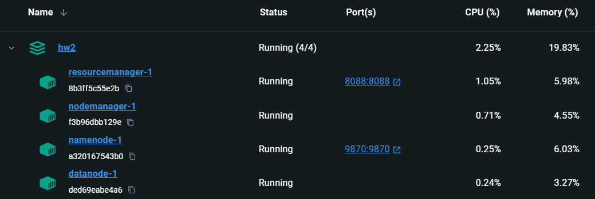
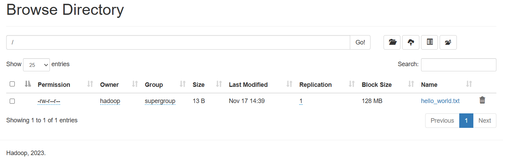
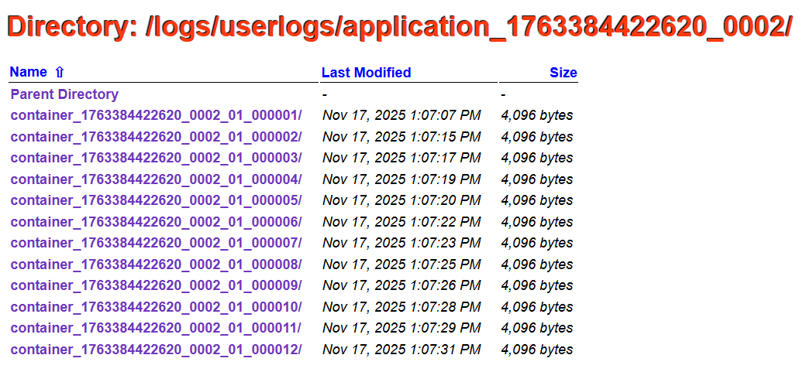

# homework

1. Run Docker Compose using `docker compose up -d`. It will deploy a name node, a data node, a resource
manage and a node manager.

    

2. Enter the name node container using `docker exec -it <data_node_container_id> /bin/bash`.
3. Create a `hello_world.txt` file locally and copy it into Hadoop cluster:
    ```bash
    bash-4.2$ touch hello_world.txt
    bash-4.2$ cat > hello_world.txt    
    hello world!
    ^C
    bash-4.2$ hadoop fs -copyFromLocal ./hello_world.txt /
    ```
 
    The file can be observed in Hadoop UI:

    

4. Check that added file contains correct data:

    ```bash
    bash-4.2$ hadoop fs -cat /hello_world.txt             
    hello world!
    ```

5. Run Pi job using YARN:

    ```bash
    bash-4.2$ yarn jar share/hadoop/mapreduce/hadoop-mapreduce-examples-3.3.6.jar pi 10 15
    Number of Maps  = 10
    Samples per Map = 15
    Wrote input for Map #0
    Wrote input for Map #1
    Wrote input for Map #2
    Wrote input for Map #3
    Wrote input for Map #4
    Wrote input for Map #5
    Wrote input for Map #6
    Wrote input for Map #7
    Wrote input for Map #8
    Wrote input for Map #9
    Starting Job
    2025-11-17 12:45:07 INFO  DefaultNoHARMFailoverProxyProvider:64 - Connecting to ResourceManager at resourcemanager/172.19.0.5:8032
    2025-11-17 12:45:08 INFO  JobResourceUploader:907 - Disabling Erasure Coding for path: /tmp/hadoop-yarn/staging/hadoop/.staging/job_1763383453575_0001
    2025-11-17 12:45:08 INFO  FileInputFormat:300 - Total input files to process : 10
    2025-11-17 12:45:08 INFO  JobSubmitter:202 - number of splits:10
    2025-11-17 12:45:09 INFO  JobSubmitter:298 - Submitting tokens for job: job_1763383453575_0001
    2025-11-17 12:45:09 INFO  JobSubmitter:299 - Executing with tokens: []
    2025-11-17 12:45:09 INFO  Configuration:2854 - resource-types.xml not found
    2025-11-17 12:45:09 INFO  ResourceUtils:476 - Unable to find 'resource-types.xml'.
    2025-11-17 12:45:09 INFO  YarnClientImpl:338 - Submitted application application_1763383453575_0001
    2025-11-17 12:45:09 INFO  Job:1682 - The url to track the job: http://resourcemanager:8088/proxy/application_1763383453575_0001/
    2025-11-17 12:45:09 INFO  Job:1727 - Running job: job_1763383453575_0001
    2025-11-17 12:45:18 INFO  Job:1748 - Job job_1763383453575_0001 running in uber mode : false
    2025-11-17 12:45:18 INFO  Job:1755 -  map 0% reduce 0%
    2025-11-17 12:45:25 INFO  Job:1755 -  map 20% reduce 0%
    2025-11-17 12:45:26 INFO  Job:1755 -  map 30% reduce 0%
    2025-11-17 12:45:27 INFO  Job:1755 -  map 40% reduce 0%
    2025-11-17 12:45:28 INFO  Job:1755 -  map 50% reduce 0%
    2025-11-17 12:45:29 INFO  Job:1755 -  map 70% reduce 0%
    2025-11-17 12:45:31 INFO  Job:1755 -  map 90% reduce 0%
    2025-11-17 12:45:32 INFO  Job:1755 -  map 100% reduce 0%
    2025-11-17 12:45:33 INFO  Job:1755 -  map 100% reduce 100%
    2025-11-17 12:45:34 INFO  Job:1766 - Job job_1763383453575_0001 completed successfully
    2025-11-17 12:45:34 INFO  Job:1773 - Counters: 54
            File System Counters
                    FILE: Number of bytes read=226
                    FILE: Number of bytes written=3045163
                    FILE: Number of read operations=0
                    FILE: Number of large read operations=0
                    FILE: Number of write operations=0
                    HDFS: Number of bytes read=2590
                    HDFS: Number of bytes written=215
                    HDFS: Number of read operations=45
                    HDFS: Number of large read operations=0
                    HDFS: Number of write operations=3
                    HDFS: Number of bytes read erasure-coded=0
            Job Counters 
                    Launched map tasks=10
                    Launched reduce tasks=1
                    Rack-local map tasks=10
                    Total time spent by all maps in occupied slots (ms)=25388
                    Total time spent by all reduces in occupied slots (ms)=5737
                    Total time spent by all map tasks (ms)=25388
                    Total time spent by all reduce tasks (ms)=5737
                    Total vcore-milliseconds taken by all map tasks=25388
                    Total vcore-milliseconds taken by all reduce tasks=5737
                    Total megabyte-milliseconds taken by all map tasks=25997312
                    Total megabyte-milliseconds taken by all reduce tasks=5874688
            Map-Reduce Framework
                    Map input records=10
                    Map output records=20
                    Map output bytes=180
                    Map output materialized bytes=280
                    Input split bytes=1410
                    Combine input records=0
                    Combine output records=0
                    Reduce input groups=2
                    Reduce shuffle bytes=280
                    Reduce input records=20
                    Reduce output records=0
                    Spilled Records=40
                    Shuffled Maps =10
                    Failed Shuffles=0
                    Merged Map outputs=10
                    GC time elapsed (ms)=601
                    CPU time spent (ms)=5460
                    Physical memory (bytes) snapshot=3020255232
                    Virtual memory (bytes) snapshot=29793632256
                    Total committed heap usage (bytes)=2455240704
                    Peak Map Physical memory (bytes)=303325184
                    Peak Map Virtual memory (bytes)=2709852160
                    Peak Reduce Physical memory (bytes)=244944896
                    Peak Reduce Virtual memory (bytes)=2714431488
            Shuffle Errors
                    BAD_ID=0
                    CONNECTION=0
                    IO_ERROR=0
                    WRONG_LENGTH=0
                    WRONG_MAP=0
                    WRONG_REDUCE=0
            File Input Format Counters 
                    Bytes Read=1180
            File Output Format Counters 
                    Bytes Written=97
    Job Finished in 26.326 seconds
    Estimated value of Pi is 3.17333333333333333333
    ```

    The job can be found in Resource Manager UI by its ID:

    

    The logs cannot be seen in Resource Manager UI because in the current set up log
    aggregation is disabled.

6. To enable log aggregation, I added the following variables to `config.env` file:

    ```
    YARN-SITE.XML_yarn.log-aggregation-enable=true
    YARN-SITE.XML_yarn.log-aggregation.retain-seconds=604800
    ```

    Now, logs can be observed at Node Manager Node (in Resource Manager UI, there will be a link to Node Manager):

    